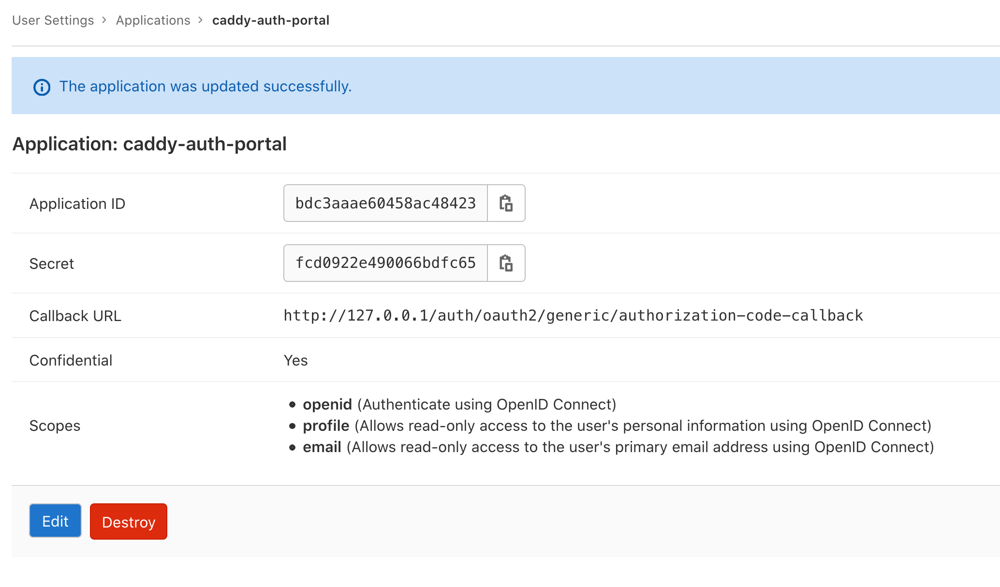

# Example how to connect caddy-auth-portal to self hosted GitLab instance

How to connect [caddy-auth-portal](https://github.com/greenpau/caddy-auth-portal) to self hosted GitLab instance.

## Build stephaneklein/caddy-auth-portal:2.2.1-alpine Docker image

See [./docker-image/](./docker-image/)

## Configure GitLab Application

Configure new [GitLab Application](https://docs.gitlab.com/ce/integration/oauth_provider.html):


<br />



## Configure and test caddy-auth-portal

Replace this variables in [`config/Caddyfile`](./config/Caddyfile):

- `base_auth_url https://gitlab.com`
- `metadata_url https://gitlab.com/.well-known/openid-configuration`
- `client_id secret`
- `client_secret secret`

```sh
docker-compose up -d
```

Open your browser on http://127.0.0.1
